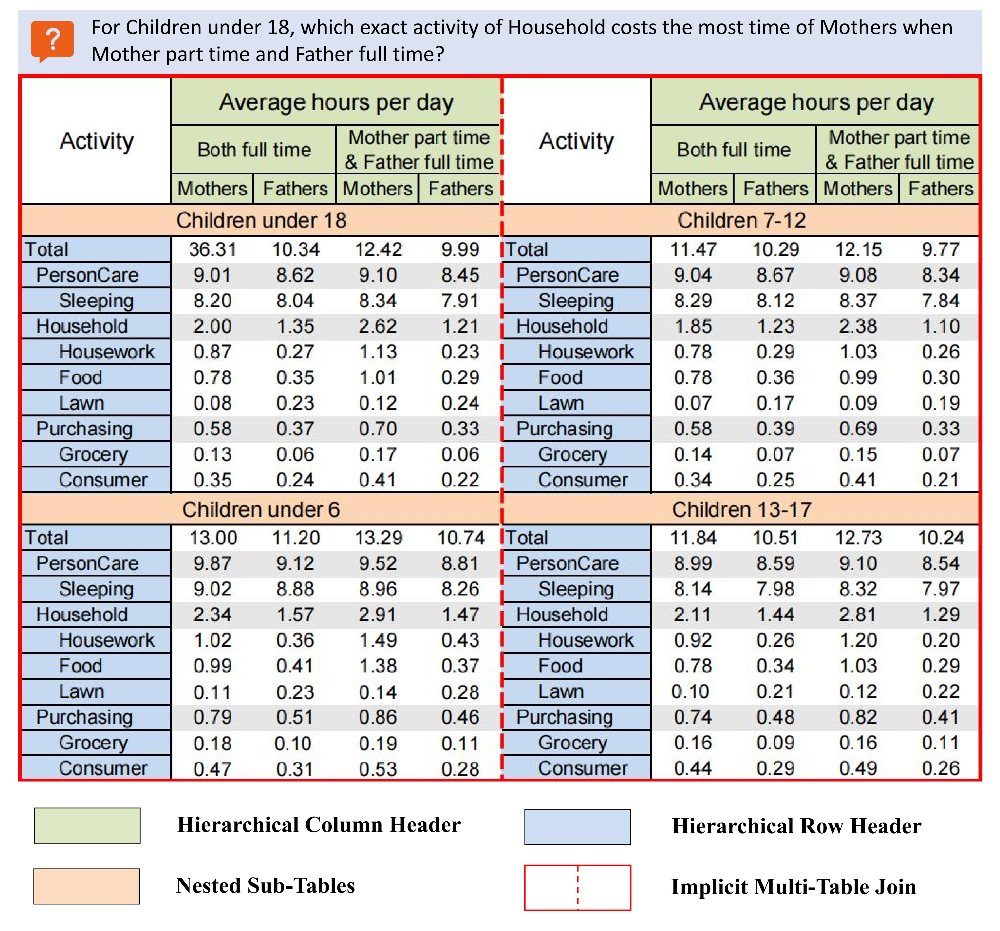
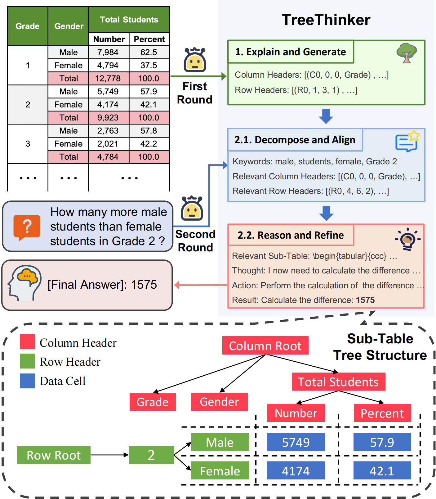

# RealHiTBench
<div align="left" style="line-height: 1;">
  <a href="" style="margin: 2px;">
    
  </a>
  <a href="" style="margin: 2px;">
    
  </a>
</div>

Official repository for paper `RealHiTBench: A Comprehensive Realistic Hierarchical Table Benchmark for Evaluating LLM-Based Table Analysis`

<p align="left">
    <a href="https://arxiv.org/abs/2506.13405">📖Paper</a>  <a href="https://huggingface.co/datasets/spzy/RealHiTBench">⌨️RealHiTBench</a>
</p>

## Overview

**RealHiTBench** is a challenging benchmark designed to evaluate the ability of large language models (LLMs) and multimodal LLMs (MLMs) to understand and reason over complex, real-world **hierarchical tables**. It features diverse question types and input formats—including *LaTeX*, *HTML*, and *PNG*—across 24 domains, with 708 tables and 3,752 QA pairs. Unlike existing datasets that focus on flat structures, RealHiTBench includes rich structural complexity such as nested sub-tables and multi-level headers, making it a comprehensive resource for advancing table understanding in both text and visual modalities.

## Complex Structures

### Catagories

We have collected as comprehensive a set of realistic hierarchical tables as possible and categorized the complex structures they represent. These structures are classified into four main categories, along with a miscellaneous category for others.

- **Hierarchical Column header:** Column headers form multi-level hierarchies through cell merging, organizing column attributes to reflect categorical relationships.
- **Hierarchical Row header:** Row headers use indentation or multiple merged columns to represent semantic hierarchies and classify row entries.
- **Nested Sub-Tables:** The table is divided into multiple sub-tables by full-width horizontal cells, segmenting content into distinct semantic regions.
- **Multi-Table Join:** Tables include explicit or implicit multi-table structures that appear as single tables but actually consist of structurally similar sub-tables, often implying comparison or alignment.
- **Miscellaneous:** Non-structural elements such as explanatory text or cell background colors also carry important information and affect table interpretation.

### Complex Table Sample

Here is a complex table sample used to showcase the above complex structure.

<p align="center">

</p>

## Procedure for Evaluation

### Step 1. Install Dependencies

```bash
pip install -r requirements.txt
```

### Step 2. Download the Dataset

Download [**RealHiTBench**](https://huggingface.co/datasets/spzy/RealHiTBench) from Hugging Face to the `data` directory.

### Step 3. Run Model Inference & Obtain Evaluation Results

We've designed the inference & evaluation code to be as convenient as possible. As mentioned above, we evaluate the performance of LLMs, MLMS, and their combination. The scripts are as follows:

#### For Open-Source LLMs:

```bash
python inference_llm.py --model [model] --model_dir [model_dir] --max_input [max_input]
```

**Descriptions of Arguments:**
[model]: The name of the model currently being evaluated, which is used to name the results.
[model_dir]: Directory of the model, which may be from the community or from a local source.
[max_input]: Restrictions on input length (must be entered according to the current model; otherwise, it defaults to 0).

#### For Open-Source MLMs:

For MLMs with image-based input:

```bash
python inference_mlm.py --model [model] --model_dir [model_dir]
```

For MLMs with image+text-based input:

```bash
python inference_mix.py --model [model] --model_dir [model_dir]
```

#### For Close-Source models:

```bash
python inference_close.py --model [model] --api_key [api_key] --base_url [base_url]
```

**Descriptions of Arguments:**
[model]: The name of the model currently being evaluated, which is used to name the results.
[api_key]: The API key required to run the model.
[base_url]: The URL of the platform where the model is located.

## TreeThinker

We propose **TreeThinker**, a pipeline that injects table hierarchies into instructions for enhanced reasoning. It utilizes a tree structure to organize hierarchical headers and guides the language model to better perceive table structures, thereby improving performance on complex table tasks.

<p align="center">

</p>

Refer to our **[paper](https://arxiv.org/abs/2506.13405)** for more details.

Since TreeThinker is a pipeline based on hierarchy extraction and prompt engineering, you can evaluate how your model performs when combined with TreeThinker by replacing the Python program in the aforementioned scripts (e.g., changing `inference_llm.py` to `inference_llm_tree_self_v3_1.py`).

## Citation

If you find RealHiTBench is useful in your work, please consider citing the paper:

```bibtext
@misc{wu2025realhitbenchcomprehensiverealistichierarchical,
      title={RealHiTBench: A Comprehensive Realistic Hierarchical Table Benchmark for Evaluating LLM-Based Table Analysis}, 
      author={Pengzuo Wu and Yuhang Yang and Guangcheng Zhu and Chao Ye and Hong Gu and Xu Lu and Ruixuan Xiao and Bowen Bao and Yijing He and Liangyu Zha and Wentao Ye and Junbo Zhao and Haobo Wang},
      year={2025},
      eprint={2506.13405},
      archivePrefix={arXiv},
      primaryClass={cs.CL},
      url={https://arxiv.org/abs/2506.13405}, 
}
```
