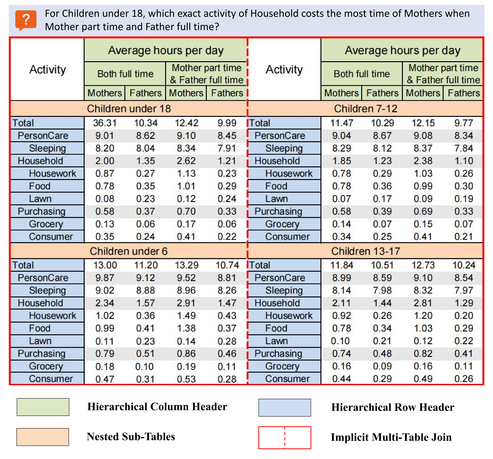

# RealHiTBench

  
  

Official repository for paper `RealHiTBench: A Comprehensive Realistic Hierarchical Table Benchmark for Evaluating LLM-Based Table Analysis`

    <a href="">📖Paper</a>  <a href="https://huggingface.co/datasets/spzy/RealHiTBench">⌨️RealHiTBench</a>

## Overview

**RealHiTBench** is a challenging benchmark designed to evaluate the ability of large language models (LLMs) and multimodal LLMs to understand and reason over complex, real-world **hierarchical tables**. It features diverse question types and input formats—including *LaTeX*, *HTML*, and *PNG*—across 24 domains, with 708 tables and 3,752 QA pairs. Unlike existing datasets that focus on flat structures, RealHiTBench includes rich structural complexity such as nested sub-tables and multi-level headers, making it a comprehensive resource for advancing table understanding in both text and visual modalities.

## Complex Structures

### Catagories

We have collected as comprehensive a set of realistic hierarchical tables as possible and categorized the complex structures they represent. These structures are classified into four main categories, along with a miscellaneous category for others.

- **Hierarchical Column header:** Column headers form multi-level hierarchies through cell merging, organizing column attributes to reflect categorical relationships.
- **Hierarchical Row header:** Row headers use indentation or multiple merged columns to represent semantic hierarchies and classify row entries.
- **Nested Sub-Tables:** The table is divided into multiple sub-tables by full-width horizontal cells, segmenting content into distinct semantic regions.
- **Multi-Table Join:** Tables include explicit or implicit multi-table structures that appear as single tables but actually consist of structurally similar sub-tables, often implying comparison or alignment.
- **Miscellaneous:** Non-structural elements such as explanatory text or cell background colors also carry important information and affect table interpretation.

### Complex Table Sample

Here is a complex table sample used to showcase the above complex structure.

